# 多人FPS游戏


## 一、开发环境：
- UE4.27.2
- VS2022

## 二、效果演示：

### 1、开局界面

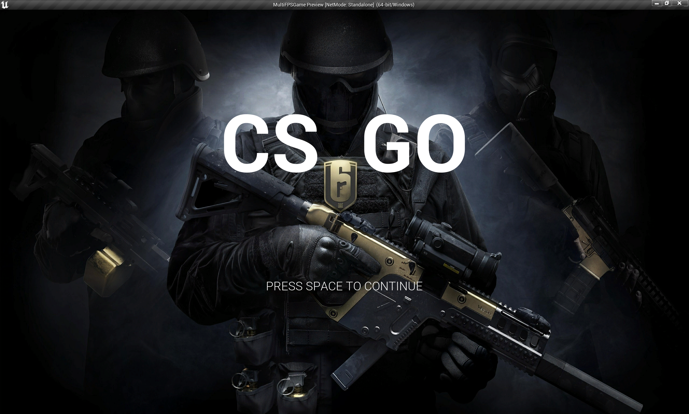

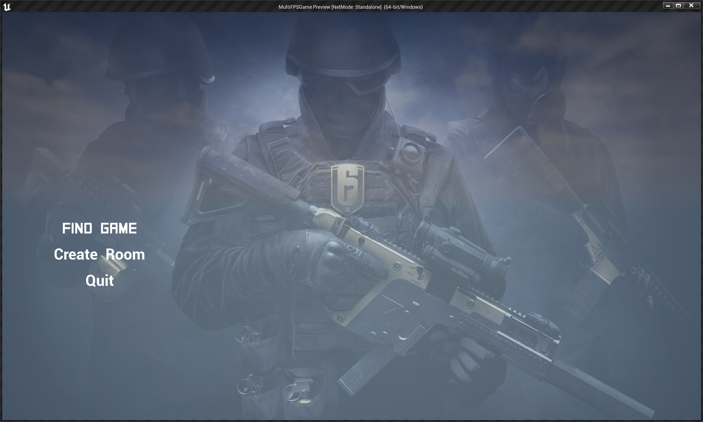

### 2、搜索房间

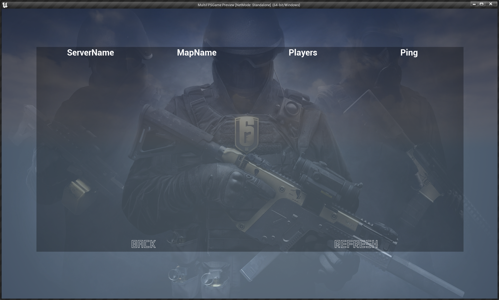

### 3、游戏

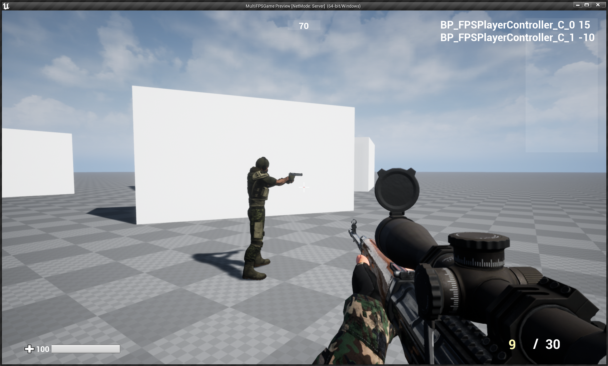

## 三、打包Server端：

* 首先运行UnrealFrontend程序，没有就编译一个

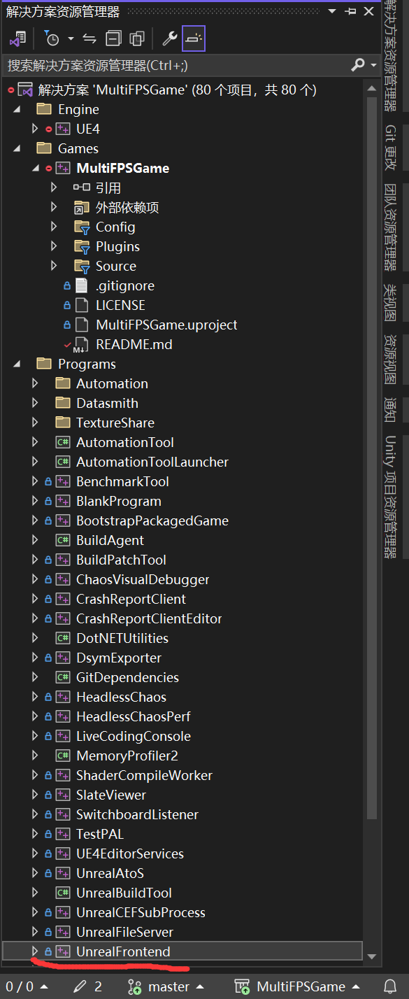

* 添加

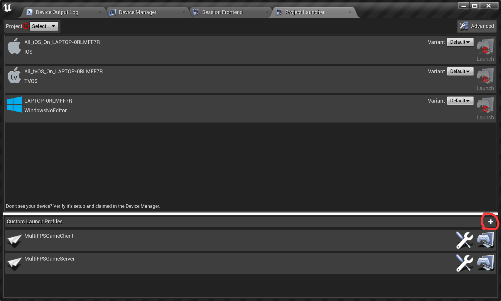

* 设置

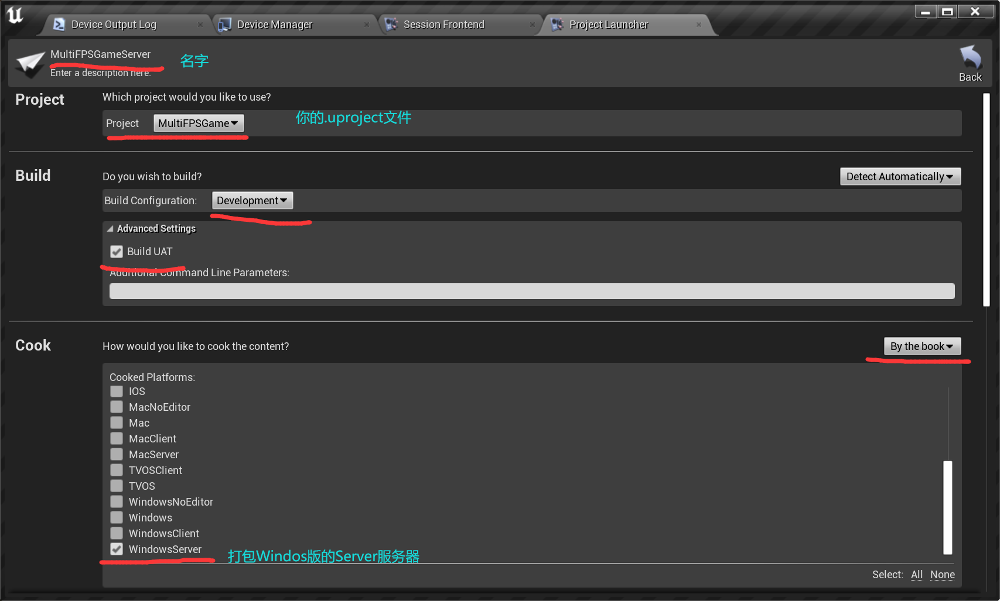

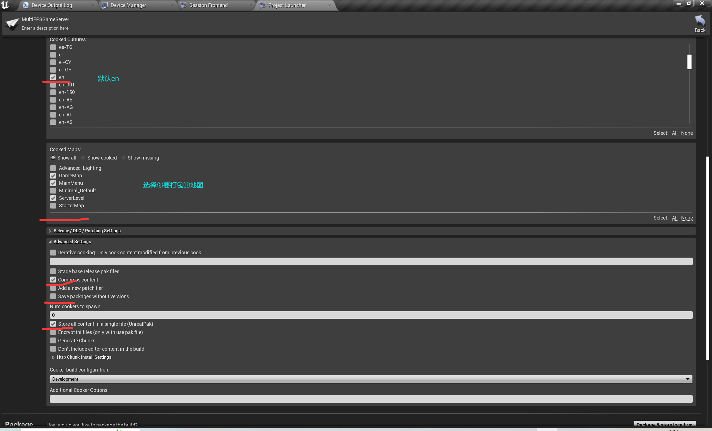

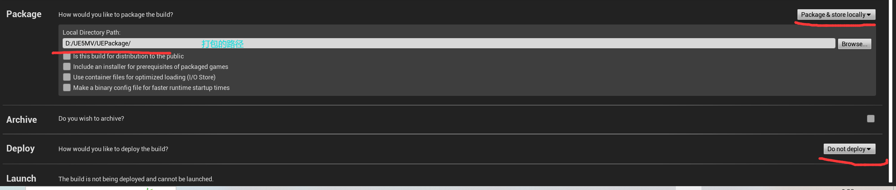

* 然后打包

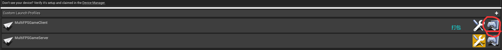


## 四、Client打包：

* 基本与Server相同，就一处不同，要打包这个，这个是最小打包，应该对应于UE的Standalone吧

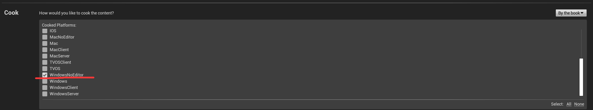


## 五、出现的问题：

**如果UE4Editor打包服务器或者编译AutomationTool的时候提示如下相关错误**

` 错误 CS0234 命名空间“Windows”中不存在类型或命名空间名“Management”(是否缺少程序集引用?) HoloLens.Automation `

或者
`警告 未能找到引用的组件“Windows”。 HoloLens.Automation`
`警告 未能解析此引用。未能找到程序集“Windows”。请检查磁盘上是否存在该程序集。 如果您的代码需要此引用，则可能出现编译错误。 HoloLens.Automation`

### 一、查看该Windows程序集的信息,右键查看属性

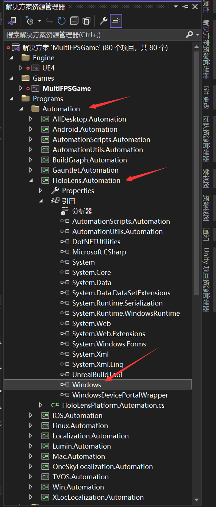

### 二、如果你的工程里面的路径值为空，或者没有这个文件进行以下步骤：

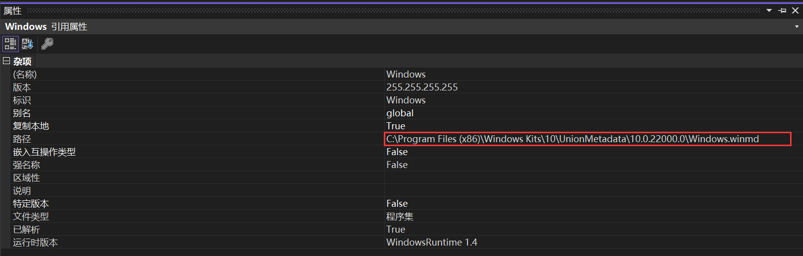

### 三、步骤

#### 1、删除该程序集

#### 2、右键`引用` - > `添加引用` - > `右下角 "浏览"`

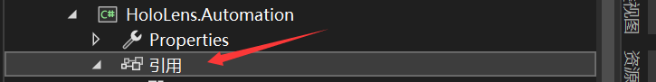

#### 3、随便找到一个SDK的这个目录

比如…

```shell
C:\Program Files (x86)\Windows Kits\10\UnionMetadata\10.0.18362.0
C:\Program Files (x86)\Windows Kits\10\UnionMetadata\10.0.16299.0
C:\Program Files (x86)\Windows Kits\10\UnionMetadata\10.0.17134.0
C:\Program Files (x86)\Windows Kits\10\UnionMetadata\10.0.17763.0
C:\Program Files (x86)\Windows Kits\10\UnionMetadata\10.0.19041.0
C:\Program Files (x86)\Windows Kits\10\UnionMetadata\10.0.20348.0
```

#### 4、找到`Windows.winmd文件`

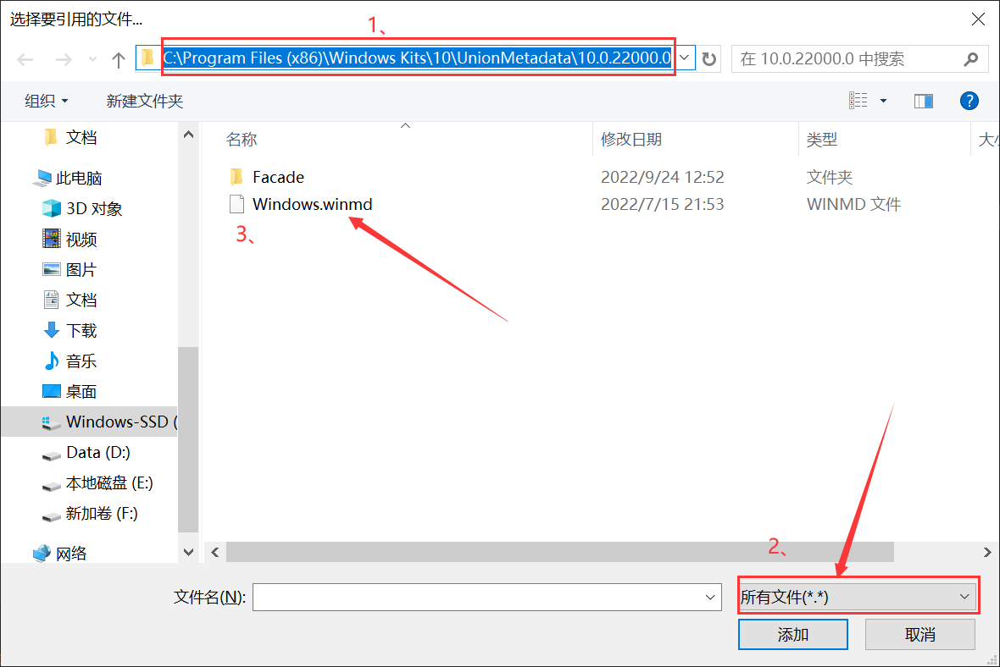

#### 5、重新编译即可解决!
